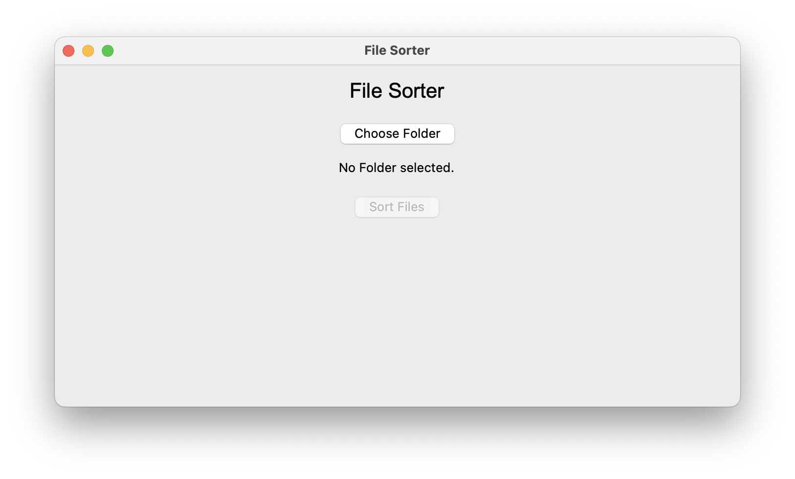
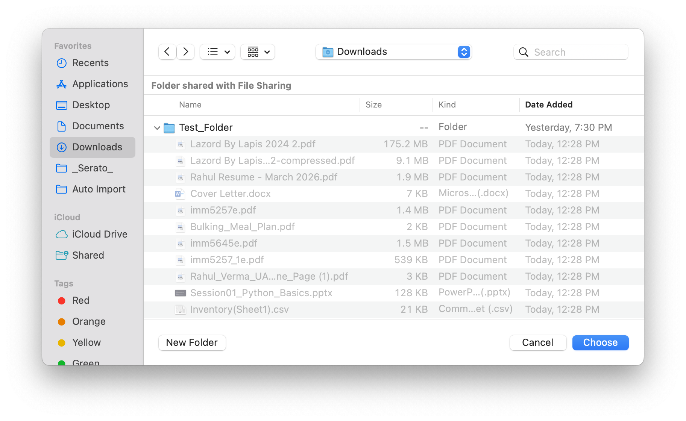
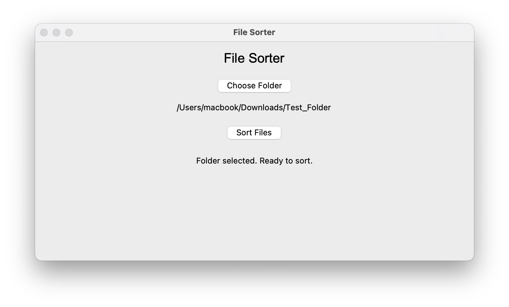
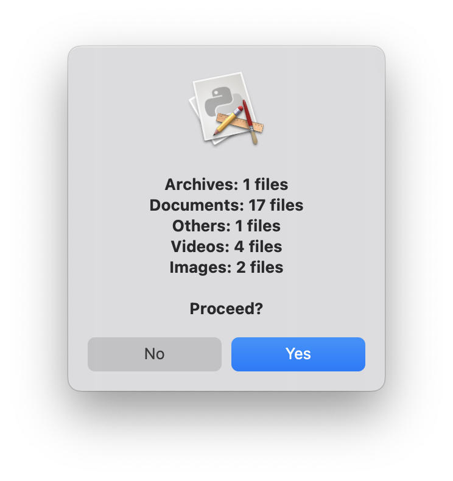
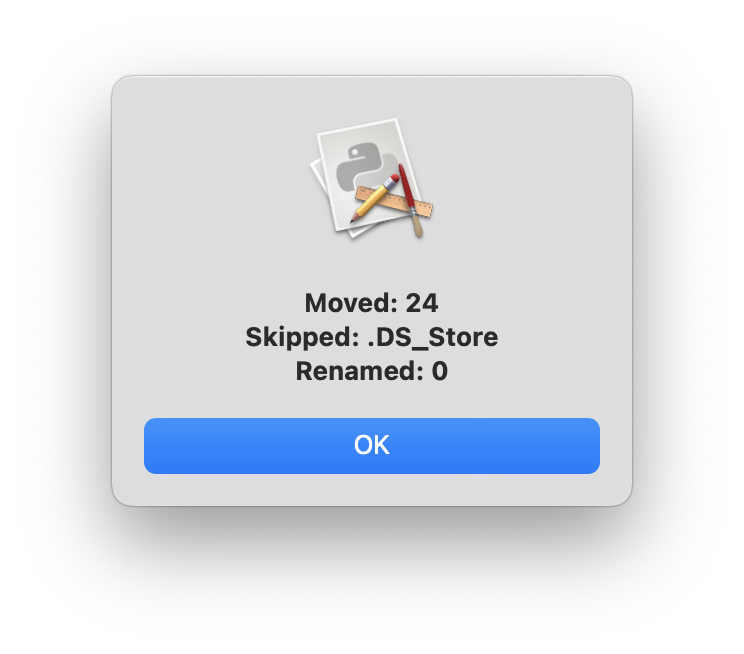
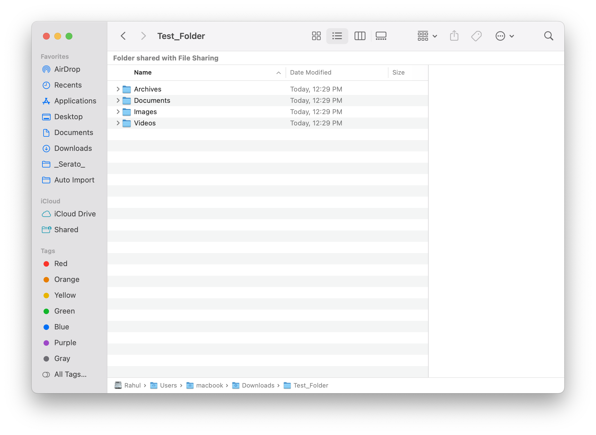

# 📁 File Sorter App (macOS)

A Python desktop application that automatically organizes files into category-based folders such as Images, Documents, Videos, Audio, Archives, and Others.

---

## 🚀 Features

* 📂 Select any folder from your system
* 🔍 Preview file categories before sorting
* ✅ Confirmation popup before execution
* 🧠 Smart categorization (Images, Docs, Videos, etc.)
* 🔁 Duplicate file handling (auto-renaming)
* 🔡 Case-insensitive extension support
* 🖥️ Packaged as a macOS `.app` using py2app

---

## 🛠️ Tech Stack

* Python
* Tkinter (GUI)
* py2app (macOS packaging)
* OS & Shutil modules

---

## 📸 Screenshots








Example:

* Main App Window
* Preview Popup
* Sorting Result Popup
* Sorted Folder View

---

## ▶️ How to Run (Development)

```bash
cd File_Sorter_Project
source .venv/bin/activate
python main.py
```

---

## 📦 Build macOS App

```bash
python setup.py py2app
```

Then open:

```
dist/File_Sorter.app
```

---

## 📂 Project Structure

```
main.py
sorter.py
setup.py
README.md
requirements.txt
Screenshots/
```

---

## 💡 Future Improvements

* Progress bar while sorting
* Drag & drop folder support
* Custom category editing
* Dark mode UI
* Windows `.exe` version

---

## 👨‍💻 Author

**Rahul Verma**  
Python Developer | Automation Enthusiast
